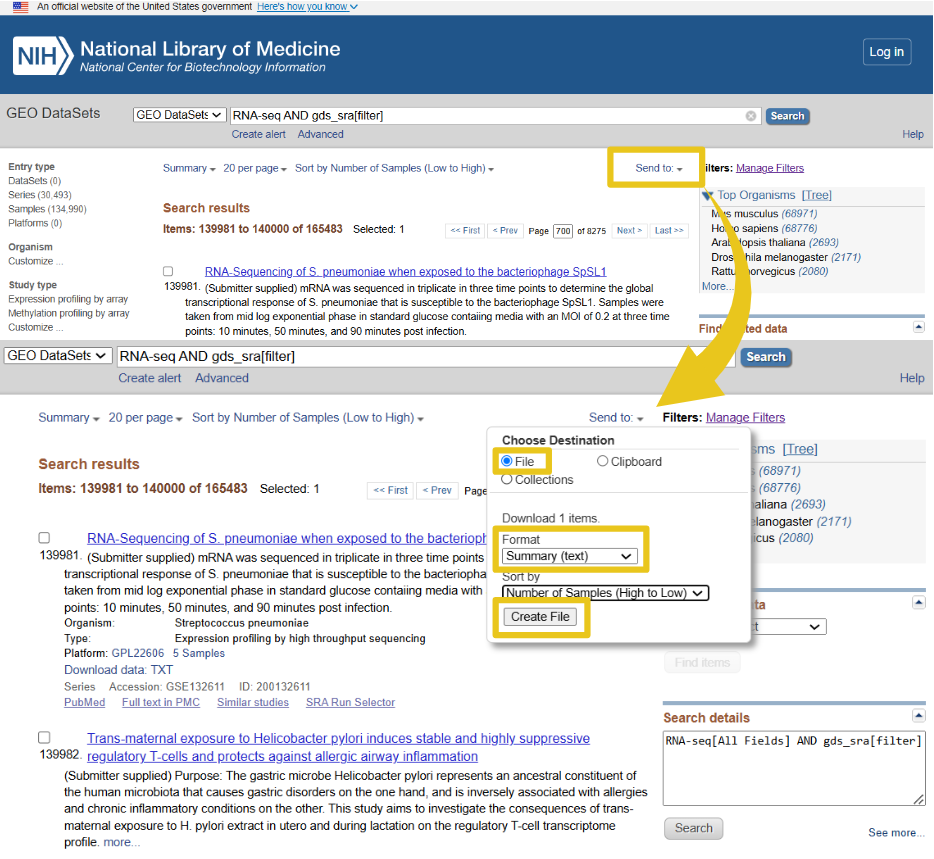

`SRAscraper` (Pipeline for downloading fastq sequencing datasets from the NIH/NCBI sequencing read archive (SRA) database)

## Requirements
To run `SRAscraper` you need a UNIX environment that contains a [Bioconda](http://bioconda.github.io/) setup.

## Installation

### Conda environment
First, clone the SRAscraper github repo to your local machine and then set up a conda environment that will install all the required software needed to run the SRAscraper pipeline. The conda environment can be made from the environment.yaml file included in the github repo after it has been cloned to your local machine.
```
git clone https://github.com/Diako-Lab/SRAscraper.git && cd SRAscraper

conda env create -f environment.yaml

conda activate SRAscraper
```

###  Install SRAscraper binary
You can install `SRAscraper` from the setup.py into the conda environment by now running the following command in the cloned github repository.
```
pip install .
```

## Running SRAscraper

### SRAscraper pipeline

`SRAscraper` is a cli wrapper for the SRAscraper pipeline implemented using [Snakemake](http://snakemake.readthedocs.io/). The user will provide information about what SRA bioprojects they would like to download fastqs from as well as the location of the output directory where those files will be downloaded to all which is written into a config.yaml file in the first part of the pipeline. Following that initial step, the pipeline config is fed to the Snakemake workflow so that different programs can be chained together to frist download the fastqs and then check the quality of the fastqs producing an ultimate suammary quality control target file.  

The command `SRAscraper create-config . config.yaml` is the first step in the pipeline and will generate the `config.yaml` containing all the parameters which will be used to run the pipeline and can be modified easily.

********

## Example
nstallation
Below is an example of how to generate a config.yaml by running `SRAscraper create-config` and then supplying the gds_result.txt file provided with the github repo to test installation. 

```
SRAscraper create-config results cli/gds_result.txt config.yaml
```

Here is an explanation of each of the inputs:

* results: Name of the output directory where you like the pipeline to produce files.
* cli/gds_result.txt: NCBI search result file which will list ftp locations where fastq files can be identified and downloaded. More information on how to generate your own custom gds_result.txt described below.
* config.yaml: Name of config.yaml used for the pipeline. User has control over name of config.yaml file in order to mark and better organize config.yamls if pipeline is run often.

The pipeline comes with a test gsd_result.txt located in cli/gds_result.txt to confirm the pipeline is functioning correctly but the user will need to generate their own gsd_file.txt file for future runs.
This can be accomplished by searching for GEO bioprojects with a gds_sra filter on the [NIH search page](https://www.ncbi.nlm.nih.gov/gds/?term=gds_sra%5Bfilter%5D)
Once you have modified the search filters and selected all the project that you are interested in produce a summary gds_result.txt file by following the steps displayed below. 



Once you have generated the `config.yaml` file you can run the pipeline with the following command.

```
SRAscraper run-config config.yaml
```

The folder structure created by `SRAscraper run-config` will look as follows:

* metadata - contains dictionary python pickle file with metadata required to find and download fastqs
* fastq - contains all fastq files broken down by GSE bioproject and then by SRR biosample identifiers
* QC - multiqc and fastqc files
* logs - each pipeline step deposits its logs here

## Reporting errors / Requesting features
If anything goes wrong using `SRAscraper` or any features are missing, feel free to open an issue on this github repo.

## Citing
Please make sure to cite the [github repository](https://github.com/Diako-Lab/SRAscraper) when using SRAscraper for research purposes.
